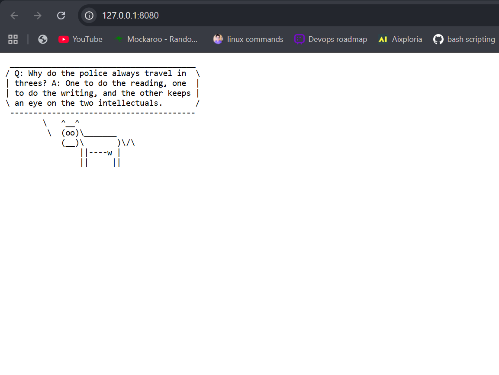

# Cow wisdom web server

## Prerequisites

```
sudo apt install fortune-mod cowsay -y
```

## How to use?

1. Run `./wisecow.sh`
2. Point the browser to server port (default 4499)

## What to expect?


## Deployment Screenshots

**Kubernetes Output:**


**App Output:**


**Port Forwarding Access:**


# Problem Statement
Deploy the wisecow application as a k8s app

## Requirement
1. Create Dockerfile for the image and corresponding k8s manifest to deploy in k8s env. The wisecow service should be exposed as k8s service.
2. Github action for creating new image when changes are made to this repo
3. [Challenge goal]: Enable secure TLS communication for the wisecow app.

## Expected Artifacts - COMPLETED ✅
1. ✅ Github repo containing the app with corresponding dockerfile, k8s manifest, any other artifacts needed.
2. ✅ Github repo with corresponding github action.
3. ✅ Github repo should be kept private and the access should be enabled for following github IDs: nyrahul

---

## Deployment Guide

### Prerequisites
- Docker
- Kubernetes cluster (v1.24+)
- kubectl configured to access your cluster
- NGINX Ingress Controller installed
- cert-manager installed in the cluster (only if you want HTTPS/TLS)

### Local Development

#### Build Docker Image
```bash
docker build -t wisecow:latest .
docker run -p 4499:4499 wisecow:latest
```

### Kubernetes Deployment

#### 1. Install Required Components

**Install cert-manager:**
```bash
kubectl apply -f https://github.com/cert-manager/cert-manager/releases/download/v1.13.0/cert-manager.yaml
```

**Install NGINX Ingress Controller:**
```bash
kubectl apply -f https://raw.githubusercontent.com/kubernetes/ingress-nginx/controller-v1.8.0/deploy/static/provider/cloud/deploy.yaml
```

#### 2. Configure and Deploy

**Update host in ingress.yaml:**
For local use with magic DNS, `k8s/ingress.yaml` is pre-set to `wisecow.127.0.0.1.sslip.io` and TLS is disabled. If your ingress controller listens on a different IP, adjust the host to `wisecow.<your-ip>.sslip.io` (or `nip.io`). For a custom domain + HTTPS, re-enable the `tls:` block and cert-manager annotations and set your domain.

**(Optional) Configure TLS Certificate Issuer:**
Only needed if you enable HTTPS. Edit `k8s/certificate-issuer.yaml` and update:
- `email`: Your email for Let's Encrypt
- DNS provider credentials (for DNS01 challenge)

**Deploy the application:**
```bash
# Create namespace and deploy resources
kubectl apply -f k8s/namespace.yaml
kubectl apply -f k8s/configmap.yaml
# If enabling TLS, also apply the issuer:
# kubectl apply -f k8s/certificate-issuer.yaml
kubectl apply -f k8s/deployment.yaml
kubectl apply -f k8s/service.yaml
kubectl apply -f k8s/ingress.yaml
```

#### 3. Verify Deployment
```bash
# Check namespace
kubectl get ns | grep wisecow

# Check deployment status
kubectl get deployment -n wisecow
kubectl get pods -n wisecow

# Check service
kubectl get svc -n wisecow

# Check ingress (and TLS if enabled)
kubectl get ingress -n wisecow
kubectl describe ingress wisecow -n wisecow

# If TLS enabled, view certificate status
kubectl get certificate -n wisecow
kubectl describe certificate wisecow-tls -n wisecow
```

#### 4. Access the Application
For local magic DNS (no TLS):
```bash
# Apply ingress then browse http://wisecow.127.0.0.1.sslip.io/
kubectl get ingress wisecow -n wisecow
```

Or port-forward without ingress:
```bash
kubectl port-forward -n wisecow svc/wisecow 8080:80
open http://127.0.0.1:8080
```

### CI/CD Pipeline

Deploying to a local cluster via GitHub Actions uses a self-hosted runner on your machine. Make sure the runner has Docker, kubectl, and access to your cluster. The workflow consumes `KUBE_CONFIG` if provided; otherwise it expects `$HOME/.kube/config` to exist on the runner.

#### GitHub Actions Workflow
The workflow in `.github/workflows/build-deploy.yml` automatically:

1. **On Push to Main Branch:**
   - Builds Docker image
   - Pushes to GitHub Container Registry (GHCR)
   - Runs security scanning with Trivy
   - Deploys to Kubernetes cluster

2. **Required Secrets:**
Configure these in GitHub repository settings:
- `KUBE_CONFIG`: Base64-encoded kubeconfig file
  ```bash
  cat ~/.kube/config | base64 | tr -d '\n'
  ```

#### Manual Workflow Trigger
```bash
# Push to main branch (triggers automatic workflow)
git push origin main

# Or manually trigger via GitHub CLI
gh workflow run build-deploy.yml
```

### TLS Configuration Details

#### Automatic Certificate Management
- **Certificate Issuer**: Let's Encrypt (Production)
- **Renewal**: Automatic (cert-manager handles 30 days before expiration)
- **Validation Methods**: HTTP01 and DNS01 challenges supported

#### DNS Configuration
Point your domain to the Ingress Controller's external IP:
```bash
# Get the external IP
kubectl get svc -n ingress-nginx

# Create DNS A record: your-domain.com -> <EXTERNAL-IP>
```

#### Certificate Verification
```bash
# Check certificate in cluster
kubectl get secret wisecow-tls -n wisecow -o jsonpath='{.data.tls\.crt}' | base64 -d | openssl x509 -text -noout

# Test HTTPS connectivity
curl -v https://your-domain.com
openssl s_client -connect your-domain.com:443 -showcerts
```

## Architecture

### Components
- **Deployment**: 3 replicas with rolling update strategy
- **Service**: ClusterIP for internal networking
- **Ingress**: HTTP by default for local magic DNS; can enable TLS with cert-manager
- **Pod Anti-Affinity**: Spreads pods across nodes for HA
- **Health Checks**: Liveness and readiness probes for reliability
- **Resource Management**: Memory and CPU limits/requests

### Network Flow
```
Internet 
    ↓ (HTTPS on port 443)
Ingress Controller
    ↓ (HTTP on port 80)
ClusterIP Service
    ↓
Pods (Port 4499)
```

## Troubleshooting

### Certificate Not Issuing
```bash
# Check certificate request status
kubectl describe certificaterequest -n wisecow

# Check cert-manager logs
kubectl logs -n cert-manager -l app=cert-manager -f

# Force renewal (if needed)
kubectl delete certificate wisecow-tls -n wisecow
```

### Deployment Issues
```bash
# Check pod logs
kubectl logs -n wisecow -l app=wisecow

# Describe deployment
kubectl describe deployment wisecow -n wisecow

# Check resource availability
kubectl top nodes
kubectl top pods -n wisecow
```

### Ingress Not Working
```bash
# Verify ingress configuration
kubectl get ingress -n wisecow
kubectl describe ingress wisecow -n wisecow

# Check ingress controller
kubectl get pods -n ingress-nginx
kubectl logs -n ingress-nginx -l app.kubernetes.io/name=ingress-nginx
```

## File Structure
```
wisecow/
├── Dockerfile                      # Container image definition
├── wisecow.sh                      # Application script
├── README.md                       # This file
├── LICENSE                         # MIT License
├── .dockerignore                   # Docker build context exclusions
├── .github/
│   └── workflows/
│       └── build-deploy.yml        # CI/CD pipeline configuration
└── k8s/
    ├── namespace.yaml              # Kubernetes namespace
    ├── configmap.yaml              # Application configuration
    ├── deployment.yaml             # Deployment specification
    ├── service.yaml                # Service definition
  ├── ingress.yaml                # Ingress (HTTP for local; enable TLS as needed)
  └── certificate-issuer.yaml     # Let's Encrypt configuration (optional)
```


