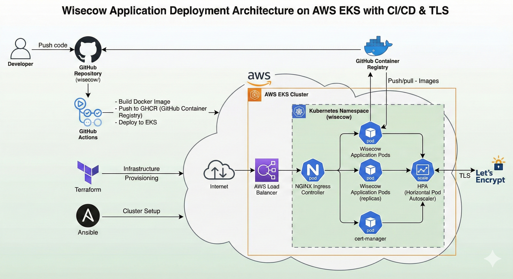

# Containerisation and Deployment of Wisecow Application on Kubernetes

A comprehensive guide for containerizing and deploying the Wisecow application on AWS EKS with automated CI/CD pipeline and TLS support.

## Table of Contents

- [Architecture Overview](#architecture-overview)
- [Project Structure](#project-structure)
- [Prerequisites](#prerequisites)
- [Quick Start](#quick-start)
- [Deployment Methods](#deployment-methods)
- [CI/CD Pipeline](#cicd-pipeline)
- [TLS Configuration](#tls-configuration)
- [Operations & Management](#operations--management)
- [Debugging & Troubleshooting](#debugging--troubleshooting)


---

## Architecture Overview

### Technology Stack
- **Container Runtime**: Docker
- **Orchestration**: Kubernetes (AWS EKS)
- **CI/CD**: GitHub Actions
- **TLS**: Let's Encrypt with cert-manager
- **Ingress**: NGINX Ingress Controller
- **Infrastructure**: Terraform
- **Configuration Management**: Ansible

### Key Features
- ✅ Multi-stage Dockerfile with security best practices
- ✅ Non-root user execution with health checks
- ✅ Automated CI/CD pipeline with GitHub Actions
- ✅ TLS termination with Let's Encrypt
- ✅ Infrastructure as Code with Terraform
- ✅ Horizontal pod autoscaling
- ✅ Comprehensive monitoring and logging

---

## Project Structure

```
wisecow/
├── 📄 Dockerfile                    # Container definition
├── 📄 docker-compose.yml           # Local development
├── 📄 .gitignore                   # Git ignore rules
├── 📄 README.md                    # Documentation
├── 📄 Certificate.TLS.info         # TLS information
├── 📁 Images/                      # Documentation images
├── 📁 k8s/                         # Kubernetes manifests
│   ├── deployment.yaml
│   ├── service.yaml
│   ├── ingress.yaml
│   └── cluster-issuer.yaml
├── 📁 terraform/                   # Infrastructure as Code
│   ├── main.tf
│   ├── iam.tf
│   ├── variables.tf
│   └── outputs.tf
├── 📁 ansible/                     # Configuration management
│   └── setup-cluster.yaml
└── 📁 .github/workflows/           # CI/CD pipeline
    └── ci-cd.yaml
```

---

## Prerequisites

### Required Tools
Ensure you have the following tools installed:

```bash
# Core tools
aws-cli        # AWS command line interface
kubectl        # Kubernetes command line tool
terraform      # Infrastructure as Code
ansible        # Configuration management
helm           # Kubernetes package manager
docker         # Container runtime
```

### AWS Permissions
Your AWS credentials must have permissions for:
- ✅ EKS cluster management
- ✅ EC2 instance management
- ✅ VPC management
- ✅ IAM role creation

### Environment Setup
```bash
# Configure AWS CLI
aws configure

# Set default region
export AWS_DEFAULT_REGION=us-east-1

# Verify tools
kubectl version --client
terraform version
ansible --version
```

---

## Quick Start

### 🚀 One-Command Deployment

```bash
# Clone repository
git clone 
cd Containerisation-and-Deployment-of-Wisecow-Application-on-Kubenetes


```


## Deployment Methods

### Method 1: Automated Deployment (Recommended)

```bash
# 1. Configure environment variables
export AWS_DEFAULT_REGION=us-east-1

# 2. Update configuration files
# - k8s/cluster-issuer.yaml (your email address)
# - .github/workflows/ci-cd.yaml (registry details)

```

### Method 2: Manual Step-by-Step Deployment

#### Step 1: Infrastructure Deployment
```bash
cd terraform
terraform init
terraform plan
terraform apply
```

#### Step 2: Configure Kubernetes
```bash
# Update kubeconfig
aws eks update-kubeconfig --region us-east-1 --name wisecow-cluster

# Install cluster components
ansible-playbook ansible/setup-cluster.yaml
```

#### Step 3: Deploy Application
```bash
# Apply Kubernetes manifests
kubectl apply -f k8s/deployment.yaml
kubectl apply -f k8s/service.yaml
kubectl apply -f k8s/cluster-issuer.yaml
kubectl apply -f k8s/ingress.yaml
```

#### Step 4: Verify Deployment
```bash
# Check all resources
kubectl get all -n wisecow

# Check certificate status
kubectl get certificates -n wisecow

# Get LoadBalancer URL
kubectl get ingress -n wisecow
```

---

## CI/CD Pipeline

### GitHub Actions Workflow

The automated pipeline includes:

#### 🔨 Build Stage (All Branches)
- Builds Docker image on every push
- Pushes to GitHub Container Registry
- Tags images with branch name and commit SHA

#### 🚀 Deploy Stage (Main Branch Only)
- Updates Kubernetes deployment
- Rolls out new version
- Verifies deployment status

### Required GitHub Secrets

Add these secrets to your GitHub repository:

```yaml
AWS_ACCESS_KEY_ID: your-aws-access-key
AWS_SECRET_ACCESS_KEY: your-aws-secret-key
```

### Workflow Triggers

| Event | Action |
|-------|--------|
| Push to `main` | Full build and deploy |
| Push to `develop` | Build only |
| Pull requests | Build and test |

---

## TLS Configuration

### Automatic Certificate Management

The application uses **Let's Encrypt** for TLS certificates:

1. **cert-manager** provisions certificates automatically
2. **NGINX Ingress** handles TLS termination
3. **Automatic renewal** ensures certificates stay valid

### Domain Configuration

```bash
# 1. Update ingress configuration
vim k8s/ingress.yaml
# Replace 'your-domain.com' with your actual domain

# 2. Update cluster issuer
vim k8s/cluster-issuer.yaml
# Replace email address with your email

# 3. Apply changes
kubectl apply -f k8s/cluster-issuer.yaml
kubectl apply -f k8s/ingress.yaml

# 4. Point DNS to LoadBalancer
kubectl get ingress -n wisecow
```

---

## Operations & Management

### Docker Operations

#### Building and Managing Images
```bash
# Build Docker image
docker build -t ghcr.io/your-username/wisecow:main-$(git rev-parse --short HEAD) .

# Push to registry
docker push ghcr.io/your-username/wisecow:main-$(git rev-parse --short HEAD)

# Tag as latest
docker tag ghcr.io/your-username/wisecow:main-$(git rev-parse --short HEAD) ghcr.io/your-username/wisecow:latest
docker push ghcr.io/your-username/wisecow:latest
```

#### Debugging Containers
```bash
# Inspect image
docker inspect ghcr.io/your-username/wisecow:latest

# Run container interactively
docker run -it --rm --entrypoint /bin/sh ghcr.io/your-username/wisecow:latest

# Test application locally
docker run -p 4499:4499 ghcr.io/your-username/wisecow:latest
curl http://localhost:4499
```

### Kubernetes Operations

#### Deployment Management
```bash
# Update deployment
kubectl rollout restart deployment wisecow-deployment -n wisecow

# Monitor rollout
kubectl rollout status deployment wisecow-deployment -n wisecow

# Check deployment status
kubectl get deployment wisecow-deployment -n wisecow -o yaml
```

#### Scaling Operations
```bash
# Manual scaling
kubectl scale deployment wisecow-deployment -n wisecow --replicas=3

# Auto-scaling
kubectl autoscale deployment wisecow-deployment --cpu-percent=70 --min=3 --max=10 -n wisecow

# Check scaling status
kubectl get hpa -n wisecow
```

#### Pod Management
```bash
# List pods
kubectl get pods -n wisecow

# Describe pod
kubectl describe pod <pod-name> -n wisecow

# Execute into pod
kubectl exec -it <pod-name> -n wisecow -- /bin/bash

# Port forward for testing
kubectl port-forward pod/<pod-name> -n wisecow 4499:4499
```

---

## Debugging & Troubleshooting

### Common Issues and Solutions
####  🔴 Get LoadBalancer from Ingress

**Symptoms**: Pods in `DNS config` or `Page not Found`

**Debug Steps**:
```bash
# Get ingress details
kubectl get ingress -n wisecow

# Get just the LoadBalancer hostname
kubectl get ingress -n wisecow -o jsonpath='{.items[0].status.loadBalancer.ingress[0].hostname}'

# More detailed ingress info
kubectl describe ingress -n wisecow

#Method 2:  Get LoadBalancer from Service
# Get all services
kubectl get svc -n wisecow

# Get LoadBalancer service specifically
kubectl get svc -n wisecow -o wide

# Get external IP/hostname
kubectl get svc -n wisecow -o jsonpath='{.items[0].status.loadBalancer.ingress[0].hostname}'

#Method 3: Comprehensive Check 
# Check all LoadBalancer services across namespaces
kubectl get svc --all-namespaces -o wide | grep LoadBalancer

# Get detailed information
kubectl get svc,ingress --all-namespaces

```
---

## Monitoring

### Health Checks

#### Application Health
```bash
# Check deployment health
kubectl get deployment wisecow-deployment -n wisecow

# Check pod health
kubectl get pods -n wisecow -o wide


#### Cluster Health
```bash
# Check cluster status
kubectl cluster-info

# Check node status
kubectl get nodes

# Check system pods
kubectl get pods --all-namespaces | grep -E "(kube-system|ingress-nginx|cert-manager)"
```


---

## Cleanup

### Application Cleanup

#### Remove Application Resources
```bash
# Delete application
kubectl delete -f k8s/

# Delete namespace
kubectl delete namespace wisecow
```

#### Remove Helm Releases
```bash
# Remove ingress controller
helm uninstall ingress-nginx -n ingress-nginx

# Remove cert-manager
helm uninstall cert-manager -n cert-manager
```

### Complete Infrastructure Cleanup


#### Manual Cleanup
```bash
# Remove Terraform infrastructure
cd terraform
terraform destroy -auto-approve

# Remove Docker images
docker rmi ghcr.io/your-username/wisecow:latest
docker system prune -a
```

---

## Development and Testing

### Local Development

#### Build and Test Locally
```bash
# Build image
docker build -t wisecow:local .

# Run locally
docker run -p 4499:4499 wisecow:local

# Test endpoint
curl http://localhost:4499
```

#### Development Workflow
```bash
# Create feature branch
git checkout -b feature/new-feature

# Make changes and test
docker build -t wisecow:test .
docker run -p 4499:4499 wisecow:test

# Commit and push
git add .
git commit -m "Add new feature"
git push origin feature/new-feature
```


---

## Support and Contributing

### Getting Help
1. Check this documentation first
2. Review application logs and events
3. Test with debugging commands provided
4. Check official Kubernetes and AWS documentation
5. Open an issue in the repository with detailed information

### Contributing
1. Fork the repository
2. Create a feature branch
3. Test all changes thoroughly
4. Update documentation as needed
5. Submit a pull request with detailed description

### Resources
- [Kubernetes Documentation](https://kubernetes.io/docs/)
- [AWS EKS Documentation](https://docs.aws.amazon.com/eks/)
- [Docker Best Practices](https://docs.docker.com/develop/dev-best-practices/)
- [Terraform Documentation](https://www.terraform.io/docs/)


